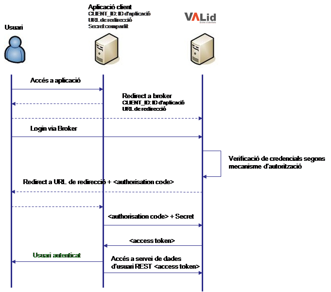
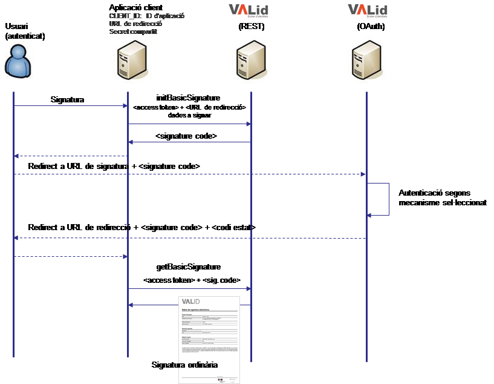
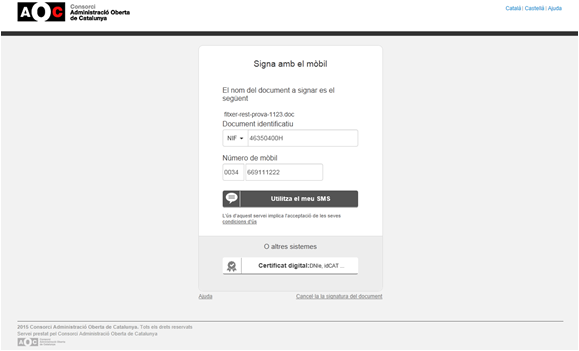
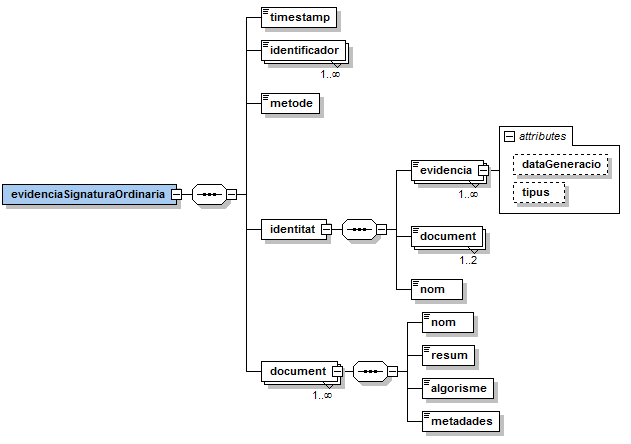

# VALid

## **DI – VALId (Validador d'identitats)**

**Índex**

- [1 Introducció 1](#1)
    * [1.1 Registre de l'aplicació client](#1.1)
    * [1.2 Entorns ](#2)
- [2 Integració de l'aplicació client](#2)
    * [2.1 Construcció de la URL](#2.1)
    * [2.2 Tractament de la resposta](#2.2)
        * [2.2.1 Generació d'un nou accés token a partir del refresh Token.](#2.2.1)
    * [2.3 Revocació d'un token d'accés](#2.3)
    * [2.4 Logout programàtic ](#2.4)
- [3 Serveis de dades de suport a les aplicacions](#3)
    * [3.1 Dades de l'usuari validat ](#3.1)
    * [3.2 Evidències d'autenticació ](#3.2)
- [4 Operacions de signatura ordinària ](#4)
    * [4.1 Signatura ordinària a partir de l'accés token ](#4.1)
    * [4.2 Signatura ordinària a partir de l'accés token i acció d'autenticació addicional ](#4.2)
    * [4.3 Consideracions sobre el resum criptogràfic](#4.3)
    * [4.4 Missatge de signatura ordinària](#4.4)
- [Annex - evidències del procés de validació ](#5)
    * [Evidències generades en la consulta a la Base de Dades de la Seu ](#6)
    * [Evidències generades en la validació amb certificat digital](#7)
    * [Evidències generades en la validació amb contrasenya al mòbil (SMS)](#8)
    * [Evidències generades en la validació amb MobileID](#9)
    * [Evidències generades en la validació amb Cl@ve](#10)

# 1 Introducció <a name="1"></a>

Aquest document detalla el procediment a seguir per a integrar-se mitjançant el protocol OAuth 2.0 amb el Validador d'Identitats del Consorci AOC (en endavant VALId).

## 1.1 Registre de l'aplicació client <a name="1.1"></a>

Abans de poder realitzar la integració amb VALId és necessari fer el registre de la aplicació client per tal que el validador la reconegui com a un client autoritzat.

Per tal de registrar una aplicació client cal posar-se en contacte amb el Consorci AOC per tal de proporcionar les següents dades:

| _Dada_ | _Descripció_ |
| --- | --- |
| Nom curt | Nom curt de la aplicació client que es vol integrar amb VALId (p.e. "eNOTUM"). |
| Descripció | Descripció de la aplicació client (p.e. "Servei de notificacions electròniques del Consorci AOC"). |
| Redirect URI | URL a la qual VALId haurà d'enviar el resultat de la autenticació (p.e. https://enotum.aoc.cat/code).  Es pot passar una llista amb més d'una URL de redirecció, tot i que no és el cas més habitual. |
| Mètodes d'autenticació | Mètodes de validació que es vol emprar per a les autenticacions a la aplicació web client.Actualment es suporten els següents mecanismes:<br>- idCAT Mòbil (contrasenya SMS al mòbil).<br>- Certificat digital.<br>- [Cl@ve](#cl@ve)  del Ministerio de Hacienda y Administraciones Públicas.<br>- [idCAT MobileConnect](#idCATMobileConnect) de GSMA.<br>- [MobileID](#MobileID) de l'Ajuntament de Barcelona. |
| Mètodes de signatura ordinària | Mètodes de validació que es vol emprar per a les signatures ordinàries que requereixen una autenticació addicional per part de l'usuari.Actualment es suporten els següents mecanismes:<br>- Contrasenya SMS al mòbil.<br>- Certificat digital. |
| Recursos de personalització | CSSs i logos amb el que es presentaran les pantalles de validació d'identitats. |
| IPs de les aplicacions clients | IPs de les aplicacions clients per tal d'habilitar l'accés als serveis de dades REST i els contexts de bescanvi de _tokens_ OAuth. |

<br> - Cl@ve del Ministerio de Hacienda y Administraciones Públicas: [http://clave.gob.es](http://clave.gob.es/).<a name="cl@ve"></a><br> - MobileConnect de GSMA: [https://mobileconnect.io](https://mobileconnect.io/). <a name="idCATMobileConnect"></a><br> - MobileID de l'Ajuntament de Barcelona: [http://www.mobileid.cat](http://www.mobileid.cat/). <a name="MobileID"></a>

Un cop la aplicació client hagi estat registrada, es proporcionarà als desenvolupadors de la integració una sèrie de codis que s'hauran d'usar en la invocació a VALId. Aquestes dades són:

- **client-id**: identificador únic de la aplicació dins de l'àmbit del VALId.
- **client-secret**: secret compartit que s'haurà d'usar a la operació de negociació del token d'accés.

Amb aquests codis els integradors podran configurar qualsevol dels clients OAuth que hi ha disponibles (existeixen implementacions per a múltiples llenguatges com Java, .NET o PHP) per protegir les seves aplicacions delegant la autenticació al VALId.

Un cop el client OAuth estigui configurat és molt possible que sigui necessari fer uns ajustos la lògica de control de la sessió d'usuari per aconseguir la aplicació client funcioni segons aquest nou model d'autenticació.

## 1.2 Entorns <a name="1.2"></a>

Es disposa de dos entorns:

- Pre-producció (entorn per realitzar integracions i proves): https://valid-pre.aoc.cat/o/oauth2
- Producció: https://valid.aoc.cat/o/oauth2

[!IMPORTANT]  
Els dominis d'identitats van canviar l'octubre de 2024, d'`identitats-pre.aoc.cat` a `valid-pre.aoc.cat`  i d'`identitats.aoc.cat` a `valid.aoc.cat`.

# 2 Integració de l'aplicació client <a name="2"></a>

VALId, basat en OAuth 2.0, permet que aplicacions desenvolupades en múltiples llenguatges de programació i tecnologies es puguin integrar fàcilment.

A continuació es descriuen les diferents parts implicades en el procés d'autenticació i com hi intervenen.

- _Servidor d'autenticació / VALId_: és l'encarregat d'identificar l'usuari. En el cas del VALId només es realitza l'autenticació, ja que no es gestiona cap recurs de l'usuari.

- _Aplicació client_: és la aplicació que es recolza en VALId per a autenticar els seus usuaris. D'aquesta manera s'estalvia mantenir una base de dades d'usuaris o actualitzar els mecanismes d'autenticació.
- _Usuari_



La seqüència d'autorització s'inicia quan l'aplicació web que s'integra realitza una redirecció cap a la URL del punt d'autenticació del VALId. Aquesta URL inclou una sèrie de paràmetres que indiquen el tipus d'accés que es vol sol·licitar. VALId realitza l'autenticació de l'usuari així com la seva sessió OAuth amb el navegador. El resultat d'aquest procés és un codi d'autorització, que és retornat per VALId cap a la aplicació web a mode de paràmetre dins d'una URL.

Un cop rebut el codi d'autorització, la aplicació web pot bescanviar aquest (junt amb el seu identificador de client i secret compartit) per un codi d'accés (anomenat _access token_) i, en alguns casos, un codi de refresc (_refresh token_).

Un cop obtingut aquest codi d'accés, l'aplicació pot donar l'usuari per autenticat i també el pot usar per consumir altres serveis de dades del Consorci AOC.

Si la aplicació ha demanat un codi de refresc durant la negociació del codi d'accés, llavors el podrà usar per obtenir nous codis d'accés en qualsevol moment. Això s'anomena accés _offline_ ja que en aquest cas no és necessari que un usuari intervingui des del seu navegador per a obtenir un nou codi d'accés.

En aquest cas, la aplicació web envia una sol·licitud de token a VALId, rep un codi d'autorització i, seguidament, bescanvia aquest codi d'autorització per un nou codi d'accés amb el qual pot seguir consumint els serveis de dades de VALId.

## 2.1 Construcció de la URL <a name="2.1"></a>

La URL que s'usa per realitzar la autenticació és: https://valid-pre.aoc.cat/o/oauth2/auth

Aquesta URL és accessible únicament per protocol segur _https_i tots els processos d'autenticació s'iniciaran accedint a aquesta, tot passant una sèrie de paràmetres dins de la _query string_ que enumerem a continuació:

| _Paràmetre_ | _Descripció_ |
| --- | --- |
| response_type | Tipus de resposta a retornar. Actualment només es suporta el valor code que indica que el servidor retornarà a la aplicació un codi d'autorització (a_uthorization_code_) per a poder negociar el token d'accés. |
| client_id | Identificador de la aplicació web que esta realitzant la operació d'autenticació. Aquest identificador és assignat pel Consorci AOC en el moment de fer el registre de l'aplicació al VALId. Aquests identificadors tenen un aspecte similar al que es mostra a continuació: <br><br>_0123456789.serveis.aoc.cat_ </br> |
| redirect_uri | URL a la que VALId haurà de retornar el resultat del procés d'autenticació.<br><br> El resultat de la operació pot ser el codi d'autorització per tal que la aplicació web pugui negociar l'_access token_ definitiu o bé un codi d'error en cas de que la validació no s'hagi pogut realitzar amb èxit.<br><br> Aquesta URL s'haurà de proporcionar en el moment del registre de l'aplicació.<br><br>Una aplicació pot tenir més d'una URI de redirecció, però totes han de constar al registre de l'aplicació del VALId. |
| scope | El paràmetre _scope_ indica una llista de permisos que la aplicació web vol obtenir sobre les dades de l'usuari.<br><br> Ara per ara, VALId només realitza l'autenticació dels usuaris i no gestiona cap autorització, pel que aquest paràmetre haurà de venir informat sempre amb el valor _autenticacio_usuari_ |
| state | Camp lliure que serà retornat a la aplicació web en el moment de fer-li arribar el resultat de la autenticació (ja sigui un _authorization_code_ o un _error_).<br><br>Donades les restriccions que hi ha en la codificació de les cadenes de text a les URL es recomana usar cadenes molt simples, sense caràcters especials (accentuats, dièresi, etc...) per tal d'evitar problemes en el moment de realitzar les redireccions. |
| access_type | Tipus d'accés. Actualment el protocol OAuth 2.0 només admet els valors _online_ i _offline_. Per a la majoria de casos, s'haurà d'informar el valor online. |
| approval_prompt | Aquest paràmetre indica si cal presentar a l'usuari la pantalla de sol·licitud de permisos que vol obtenir l'aplicació web cada cop o només el primer cop que es realitza la autenticació. <br> <br>Donat que VALId no realitza ara per ara tasques d'autorització, aquest camp no es té en compte, tot i que per especificacions del protocol OAuth és necessari informar-lo. |
| login_hint | Aquest paràmetre és opcional i normalment conté dades com l'adreça de correu electrònic de l'usuari (si l'aplicació ja la coneix) o un subidentificador. <br><br>VALId no usa aquest paràmetre pel que es pot ometre. |

A continuació es mostra un exemple de URL d'inici de procés d'autenticació:
```
https://valid-pre.aoc.cat/o/oauth2/auth?scope=autenticacio_usuari&state=codi_estat_propi&redirect_uri=https://enotum.aoc.cat/code&response_type=code&client_id=0123456789.serveis.aoc.cat&approval_prompt=auto
```

## 2.2 Tractament de la resposta <a name="2.2"></a>

La resposta s'enviarà a la URL indicada al paràmetre redirect_uri informat a la URL de petició:

- Si l'usuari es valida correctament, la resposta contindrà un codi d'autorització (i si s'havia informat el paràmetre state, també rebrà aquest valor).

```
https://enotum.aoc.cat/code?code=1/j23a71vICLQm6bTrtp7&state=codi_estat_propi
```

- Si per contra l'autenticació es cancel·lada per l'usuari, l'aplicació client rebrà un codi d'error SESSION_CANCEL.
```
https://enotum.aoc.cat/code?error=SESSION_CANCEL&state=codi_estat_propi
```

Un cop rebut el codi d'autorització, la aplicació client ha de negociar un _token_ d'accés i opcionalment un _token_ de refresc. L'obtenció d'aquest _token_ d'accés finalitza el procés d'autenticació i és llavors quan la aplicació web pot donar l'usuari per autenticat.

La URL que s'usa per negociar el _token_ d'accés és:
```
https://valid-pre.aoc.cat/o/oauth2/token
```

La negociació del _token_ d'accés es realitza mitjançant una crida POST entre el servidor de la aplicació client i el VALId. Aquesta crida ha d'incloure els següents paràmetres:

| _Paràmetre_ | _Descripció_ |
| --- | --- |
| code | Codi d'autorització rebut del VALId. |
| client_id | Identificador de la aplicació client. Ha de coincidir amb el que s'ha enviat per iniciar el procés d'autenticació. |
| client_secret | Cadena de text que fa de secret compartit entre la aplicació client i el VALId. |
| redirect_uri | URL de resposta que ha de constar a la llista de URLs registrades per a la aplicació client al VALId. El més senzill és usar la mateixa URL que s'ha especificat al moment d'iniciar el procés d'autenticació. |
| grant_type | Per especificació OAuth 2.0, el valor d'aquest camp sempre serà authorization_code. |

Un exemple de petició POST seria similar a el que es mostra a continuació:
```
POST /o/oauth2/token HTTP/1.1
Host: accounts-dev.aoc.cat
Content-Type: application/x-www-form-urlencoded

code=1/j23a71vICLQm6bTrtp7&
client_id=0123456789.serveis.aoc.cat&
client_secret=...............&
redirect_uri=https://enotum.aoc.cat/code&
grant_type=authorization_code
```

La resposta a aquesta crida conté els següents camps:

| _Paràmetre_ | _Descripció_ |
| --- | --- |
| access_token | _Token_ d'accés que acredita a autenticació de l'usuari.<br><br>Aquest _token_ es pot emprar per obtenir una sèrie de dades com les evidències d'autenticació o les dades bàsiques de l'usuari (document d'identitat i número de telèfon) invocant una sèrie de serveis REST de dades (vegeu apartat 3 d'aquest document). |
| refresh_token | _Token_ de refresc que pot ser usat per obtenir nous _tokens_ d'accés a mesura que aquests vagin expirant.<br><br>Un _token_ de refresc serà vàlid fins que l'usuari el revoqui i només serà emès pel VALId si a la petició d'autenticació inicial es va especificar el valor offline per al paràmetre access_type. |
| expires_in | Temps de vida restant per al _token_, en segons. |
| token_type | Tipus de token generat. Actualment aquest camp sempre tindrà el valor Bearer. |

La resposta a la crida vindrà donada amb representació JSON.
```json
{
    "access_token":"1/g073bzAr24Fz3Z1e44g73v",
    "expires_in":3600,
    "token_type":"Bearer"
}
```

### 2.2.1 Generació d'un nou accés token a partir del refresh Token. <a name="2.2.1"></a>

Si en la petició d'autenticació inicial s'especifica el valor offline al paràmetre accés\_type, la resposta generada contindria token de refresc assignat per a poder regenerar nous tokens d'autenticació:

```json
{
    "access_token":"1/g073bzAr24Fz3Z1e44g73v",
    "refresh_token":"zZ5c9nbFmaEQJbFaHknXQe4SjyYWwAu1qiw7Ic9_",
    "expires_in":3600,
    "token_type":"Bearer"
}
```

A partir d'aquest moment, es podran demanar nous tokens a partir de la URL que s'usa per negociar el _token_ d'accés:
```
https://valid-pre.aoc.cat/o/oauth2/token
```

A diferència del cas anterior, caldrà especificar el valor refresh_token al paràmetre grant_type i en comptes d'enviar el paràmetre code, caldrà enviar el paràmetre refresh_token amb el valor de la resposta anterior. Per exemple:
```
POST /o/oauth2/token HTTP/1.1
Host: accounts-dev.aoc.cat
Content-Type: application/x-www-form-urlencoded

refresh_token=zZ5c9nbFmaEQJbFaHknXQe4SjyYWwAu1qiw7Ic9_
client_id=0123456789.serveis.aoc.cat&
client_secret=...............&
redirect_uri=https://enotum.aoc.cat/code&
grant_type=refresh_token
```

La resposta a aquesta crida contindria el nou accés token generat:

```json
{
    "access_token":"1/eZU0_DyEUjETrw9B0VIWZvSympnrm-vnKdVzC1xF",
    "refresh_token":"zZ5c9nbFmaEQJbFaHknXQe4SjyYWwAu1qiw7Ic9_",
    "expires_in":3600,
    "token_type":"Bearer"
}
```

## 2.3 Revocació d'un token d'accés <a name="2.3"></a>

Per revocar un _token_ d'accés l'aplicació client pot realitzar una invocació a la següent URL del VALId:
```
https://valid-pre.aoc.cat/o/oauth2/revoke?token=<token_acces>
```
Si la revocació es realitza correctament, l'aplicació rebrà un codi de resposta HTTP 200. En qualsevol altre cas, rebrà un codi HTTP 400 i un missatge d'error.

La revocació del _token_ d'accés només implica que no es podrà invocar els serveis REST oferts per obtenir dades de l'usuari o les evidencies del procés d'autenticació. En cap cas la revocació d'un _token_ implica el tancament de la sessió web establerta entre el navegador de l'usuari i el VALId.

## 2.4 Logout programàtic <a name="2.4"></a>

Normalment els usuaris tanquen les seves sessions a la aplicació client a la qual han accedit, independentment del servei mitjançant el qual s'hagin autenticat. Aquest _logout_ és el que s'anomena _logout local_.

El problema d'aquest escenari és que la sessió d'usuari segueix estant activa entre el VALId i el navegador de l'usuari. Per tant, un cop es torni a intentar accedir a la aplicació web, la autenticació de l'usuari serà directa i es tornarà a iniciar sessió amb la mateixa identitat.

Per evitar aquesta situació s'ha implementat una funcionalitat que permet invalidar la sessió d'usuari al VALId tot invocant una URL, a l'igual que es fa per revocar un _token_ d'accés. Cal aclarir que aquesta funcionalitat no entra dins del protocol OAuth 2.0 i es tracta d'una característica implementada a VALId per requeriments del propi servei.

Així doncs, per tancar la sessió d'usuari a VALId, l'aplicació client pot realitzar una invocació a la següent URL:
```
https://valid-pre.aoc.cat/o/oauth2/logout?token=<token_acces>
```
La invocació retornarà un codi HTTP 200 si la operació s'ha realitzat correctament o un codi HTTP 400 si s'ha produït algun error, junt amb un missatge descriptiu.

# 3 Serveis de dades de suport a les aplicacions <a name="3"></a>

La integració amb VALId abstrau l'aplicació client de totes les tasques relacionades amb la identificació i autenticació de l'usuari.

Degut a això, és necessari oferir serveis que a partir del _token_ d'accés proporcionin informació relativa al procés d'autenticació de l'usuari, per exemple, les credencials presentades o les evidències de l'acte d'autenticació.

A continuació es descriuen els serveis REST que s'han posat a disposició de les aplicacions integrades amb VALId.

## 3.1 Dades de l'usuari validat <a name="3.1"></a>

El servei proporciona la següent informació:

El servei d'obtenció de dades de l'usuari té un únic paràmetre, l'_access token_ obtingut per la aplicació client en el moment de fer la autenticació.

| _Mètode (GET)_ | https://valid-pre.aoc.cat/serveis-rest/getUserInfo |
| --- | --- |
| _Paràmetre_ | AccessToken |
| _Resposta (exemple)_ | {<br>"status":"ok",<br>"identifier":"99999999R",<br>"prefix":"0034",<br>"phone":"609112233",<br>"documentType":"1"<br>} |

La resposta obtinguda, en format JSON, conté les següents dades:

| status | Resultat de l'operació. Cadena de text que pot tenir el valor ok o ko. |
| --- | --- |
| identifier | Document identificador de l'usuari. L'identificador por ser un NIF, un NIE o un número de passaport. |
| prefix | Codi o prefix internacional del telèfon. Per exemple 0034 per al territori espanyol. |
| phone | Número de telèfon mòbil de l'usuari. |
| identifierType | Tipus de document d'identitat. 1=NIF, 2=NIE, 3=Passaport, 4=Altres (targeta de residència comunitària, permís de residència de treball, document identificador d'un país de la CE). Només si l'usuari s'ha autenticat amb idCAT Mòbil o MobileID. |
| name | El nom de l'usuari (en cas que el mecanisme de validació el proporcioni). |
| surnames | Els cognoms de l'usuari (en cas que el mecanisme de validació el proporcioni). |
| surname1 | Primer cognom de l'usuari (en cas que el mecanisme de validació proporcioni els cognoms per separat). |
| surname2 | Segon cognom de l'usuari (en cas que el mecanisme de validació proporcioni els cognoms per separat i el segon cognom estigui informat). |
| countryCode | Codi de país de l'usuari en format ISO 3166-1 (en cas que el mecanisme de validació el proporcioni). |
| email | El correu de l'usuari (en cas que el mecanisme de validació el proporcioni). |
| userCertificate | Certificat digital de l'usuari si aquest s'ha autenticat mitjançant certificat. |
| certificateType | En cas d'autenticació amb certificat digital, tipus de certificat:<br>- 0: Persona física<br>- 1: Persona jurídica<br>- 2: Component SSL<br>- 3: Seu electrònica<br>- 4: Segell electrònic<br>- 5: Empleat públic<br>- 6: Entitat sense personalitat jurídica<br>- 7: Empleat públic amb pseudònim<br>- 8: Qualificat de segell<br>- 9: Qualificat d'autenticació de lloc web<br>- 10: Certificat de segell de temps<br>- 11: Representant de persona jurídica<br>- 12: Representant d'entitat sense personalitat jurídica |
| companyId | En cas d'autenticació amb certificat digital, CIF vinculat al certificat si aquest està informat. |
| companyName | En cas d'autenticació amb certificat digital, nom de l'empresa vinculat al certificat si aquest està informat. |
| method | Mètode d'autenticació emprat per l'usuari (_idcatmobil, certificat, clave, mobileid, mobileconnect_). |
| assuranceLevel | Nivell de seguretat de l'autenticació practicada d'acord amb el ReIdAS (_low, substantial, high_):<br>- Baix: idCAT Mòbil acreditat telemàticament.<br>- Substancial: idCAT Mòbil acreditat amb certificat o presencialment, idCAT Mobile Connect, Cl@ve, certificat qualificat en programari.<br>- Alt: certificat qualificat en targeta. |
| error | En cas d'error, missatge descriptiu de l'error que s'ha produït. |

## 3.2 Evidències d'autenticació <a name="3.2"></a>

Quan l'usuari s'autentica al VALId es generen una sèrie d'evidències de cadascuna de les operacions que el validador realitza per tal d'autenticar l'usuari. Aquestes evidències inclouen:

- Consulta i resposta a la base de dades de la Seu Electrònica del Departament de Presidència i generació i validació de la contrasenya SMS d'un sol ús en cas d'autenticació amb IDCAT-SMS.
- Verificació del certificat d'usuari en el cas d'autenticació amb certificat digital.
- Inici d'autenticació i verificacions d'estat de l'autenticació mitjançant MobileID.
- Missatges SAML en el cas d'autenticació amb Cl@ve.

El servei d'obtenció d'evidències té un únic paràmetre, l'_access token_ obtingut per la aplicació client en el moment de fer la autenticació.

| _Mètode (GET)_ | https://valid-pre.aoc.cat/serveis-rest/getAuthenticationEvidence |
| --- | --- |
| _Paràmetre_ | AccessToken (GET) |
| _Resposta (exemple)_ | {<br>&nbsp;&nbsp;&nbsp;&nbsp;"status": "ok",<br>&nbsp;&nbsp;&nbsp;&nbsp;"evidences":<br>&nbsp;&nbsp;&nbsp;&nbsp;[<br>&nbsp;&nbsp;&nbsp;&nbsp;&nbsp;&nbsp;&nbsp;&nbsp;"PD94bWwgdmVyc2l(...)RpY2lvPg==",<br>&nbsp;&nbsp;&nbsp;&nbsp;&nbsp;&nbsp;&nbsp;&nbsp;"PD94bWwgdmVyc2lvb(...)vc3RhPg==",<br>&nbsp;&nbsp;&nbsp;&nbsp;&nbsp;&nbsp;&nbsp;&nbsp;"PD94bWwgdmVy(...)jaW8+"<br>&nbsp;&nbsp;&nbsp;&nbsp;]<br>} |

La resposta obtinguda, en format JSON, conté les següents dades:

| status | Resultat de l'operació. Cadena de text que pot tenir el valor ok o ko. |
| --- | --- |
| evidences | Llista d'evidències amb les evidències codificades en Base64. <br>Per més detalls sobre les evidències d'autenticació, consulteu l'annex d'aquest mateix document. |

# 4 Operacions de signatura ordinària <a name="4"></a>

VALId ofereix dos mecanismes de signatura ordinària que es detallen a continuació:

- Signatura ordinària a partir de l'_access token_ obtingut en el procés d'autenticació.
- Signatura ordinària a partir de l_'acces token_ obtingut en el procés d'autenticació i una nova acció d'autenticació realitzada per l'usuari (p.e. contrasenya SMS al mòbil).

## 4.1 Signatura ordinària a partir de l'accés token <a name="4.1"></a>

L'autenticació de l'usuari es pot usar com a clau per generar el que s'anomena _signatura ordinària_.

Aquesta signatura consisteix en la generació d'una evidència signada en la que consten els noms i resums criptogràfics dels documents que es volen signar.

| _Mètode (POST)_ | https://valid-pre.aoc.cat/serveis-rest/getBasicSignature |
| --- | --- |
| _Petició (exemple)_ | {<br> &nbsp;&nbsp;&nbsp;&nbsp;"accessToken":"ACCESS-TOKEN",<br> &nbsp;&nbsp;&nbsp;&nbsp;"documents": [<br>&nbsp;&nbsp;&nbsp;&nbsp;&nbsp;&nbsp;&nbsp;&nbsp;{ <br>&nbsp;&nbsp;&nbsp;&nbsp;&nbsp;&nbsp;&nbsp;&nbsp;"name":"fitxer1.pdf", <br>&nbsp;&nbsp;&nbsp;&nbsp;&nbsp;&nbsp;&nbsp;&nbsp;"algorithm":"SHA1",<br>&nbsp;&nbsp;&nbsp;&nbsp;&nbsp;&nbsp;&nbsp;&nbsp; "hash":"UkVTVU0="<br>&nbsp;&nbsp;&nbsp;&nbsp;&nbsp;&nbsp;&nbsp;&nbsp;"metadata":"classificacio=00002;format=PDF" <br>&nbsp;&nbsp;&nbsp;&nbsp;&nbsp;&nbsp;&nbsp;&nbsp;},<br> &nbsp;&nbsp;&nbsp;&nbsp;&nbsp;&nbsp;&nbsp;&nbsp;{ <br>&nbsp;&nbsp;&nbsp;&nbsp;&nbsp;&nbsp;&nbsp;&nbsp;"name":"fitxer2.doc",<br>&nbsp;&nbsp;&nbsp;&nbsp;&nbsp;&nbsp;&nbsp;&nbsp; "algorithm":"SHA1",<br>&nbsp;&nbsp;&nbsp;&nbsp;&nbsp;&nbsp;&nbsp;&nbsp; "hash":"UkVTVU0=" <br>&nbsp;&nbsp;&nbsp;&nbsp;&nbsp;&nbsp;&nbsp;&nbsp;}<br>&nbsp;&nbsp;&nbsp;&nbsp;],<br> "pdfEvidence":"true"<br>} |
| _Resposta (exemple)_ | {<br>&nbsp;&nbsp;&nbsp;&nbsp;"status":"ok",<br>&nbsp;&nbsp;&nbsp;&nbsp;"evidence":"PD94bW0dXJhT (...) 6U2lnbmF0dXJlPg==",<br>&nbsp;&nbsp;&nbsp;&nbsp;"pdfEvidence":"PD94bW0dXJhT (...) 6U2lnbmF0dXJlPg=="<br>} |

El servei d'obtenció de la signatura té com a paràmetres (estructura JSON), l'_access token_ obtingut per la aplicació client en el moment de fer l'autenticació i les dades dels documents :

| accessToken | L'_access token_ obtingut per la aplicació client en el moment de fer la autenticació |
| --- | --- |
| documents | Llista de documents dels quals es vol generar la signatura ordinària. |
| name | Nom del document. |
| algorithm | Algorisme emprat per calcular el resum criptogràfic del document. |
| hash | Resum criptogràfic del document. |
| metadata | Dades addicionals –text lliure- que s'incorporaran a l'evidència generada, vinculada al document. |
| pdfEvidence | Opcional. Si s'informa l'atribut es generarà la versió imprimible en PDF de l'evidència de la signatura ordinària. |

La resposta obtinguda, en format JSON, conté les següents dades:

| status | Resultat de l'operació. Cadena de text que pot tenir el valor ok o ko. |
| --- | --- |
| evidence | Signatura XAdES-T amb l'evidència de la signatura ordinària codificada en Base64.<br> Per més detalls sobre l'evidència de la signatura consulteu l'apartat 4.3 d'aquest mateix document. |
| pdfEvidence | Versió imprimible en format PDF de l'evidència de la signatura ordinària codificada en Base64. |
| error | En cas d'error, descripció de l'error que s'ha produït. |

## 4.2 Signatura ordinària a partir de l'accés token i acció d'autenticació addicional <a name="4.2"></a>

La seqüència de signatura s'inicia quan l'aplicació web que s'integra desitja generar una signatura ordinària però, a diferència del cas anterior, es vol que l'usuari realitzi una nova acció d'autenticació (p.e. informar una contrasenya d'un sòl ús SMS al seu mòbil).

Per fer-ho, l'aplicació web ha de realitzar una operació REST _initBasicSignature_ tot indicant l'_access token_ associat a l'usuari autenticat, una URL de redirecció de l'aplicació client on rebre el resultat de la signatura i les dades dels documents a signar:



| _Mètode (POST)_ | https://valid-pre.aoc.cat/serveis-rest/initBasicSignature |
| --- | --- |
| _Petició (exemple)_ | {<br>&nbsp;&nbsp;&nbsp;&nbsp; "accessToken":"ACCESS-TOKEN",<br>&nbsp;&nbsp;&nbsp;&nbsp;"redirectUri":"URL-REDIRECT",<br>&nbsp;&nbsp;&nbsp;&nbsp; "documents": [<br>&nbsp;&nbsp;&nbsp;&nbsp;&nbsp;&nbsp;&nbsp;&nbsp;{ <br>&nbsp;&nbsp;&nbsp;&nbsp;&nbsp;&nbsp;&nbsp;&nbsp;"name":"fitxer1.pdf",<br>&nbsp;&nbsp;&nbsp;&nbsp;&nbsp;&nbsp;&nbsp;&nbsp; "algorithm":"SHA1", <br>&nbsp;&nbsp;&nbsp;&nbsp;&nbsp;&nbsp;&nbsp;&nbsp;"hash":"UkVTVU0=""metadata":"classificacio=00002;format=PDF" <br>&nbsp;&nbsp;&nbsp;&nbsp;&nbsp;&nbsp;&nbsp;&nbsp;},<br>&nbsp;&nbsp;&nbsp;&nbsp;&nbsp;&nbsp;&nbsp;&nbsp; { <br>&nbsp;&nbsp;&nbsp;&nbsp;&nbsp;&nbsp;&nbsp;&nbsp;"name":"fitxer2.doc", <br>&nbsp;&nbsp;&nbsp;&nbsp;&nbsp;&nbsp;&nbsp;&nbsp;"algorithm":"SHA1",<br>&nbsp;&nbsp;&nbsp;&nbsp;&nbsp;&nbsp;&nbsp;&nbsp; "hash":"UkVTVU0=" <br>&nbsp;&nbsp;&nbsp;&nbsp;&nbsp;&nbsp;&nbsp;&nbsp;}<br>&nbsp;&nbsp;&nbsp;&nbsp;]<br>} |
| _Resposta (exemple)_ | {<br>&nbsp;&nbsp;&nbsp;&nbsp;"status":"ok",<br>&nbsp;&nbsp;&nbsp;&nbsp;"signatureCode":"XXXXXXXXXXXXXXXXXXX"<br>} |

El servei d'inici de signatura té com a paràmetres (estructura JSON), l'_access token_ obtingut per la aplicació client en el moment de fer l'autenticació i les dades dels documents:

| accessToken | L'_access token_ obtingut per la aplicació client en el moment de fer la autenticació |
| --- | --- |
| redirectUri | URL de redirecció de l'aplicació client que rebrà el resultat de la signatura. |
| documents | Llista de documents dels quals es vol generar la signatura ordinària. |
| name | Nom del document. |
| algorithm | Algorisme emprat per calcular el resum criptogràfic del document. |
| hash | Resum criptogràfic del document. |
| metadata | Dades addicionals –text lliure- que s'incorporaran a l'evidència generada, vinculada al document. |
| pdfEvidence | Opcional. Si s'informa l'atribut es generarà la versió imprimible en PDF de l'evidència de la signatura ordinària. |

La resposta obtinguda, en format JSON, conté les següents dades:

| status | Resultat de l'operació. Cadena de text que pot tenir el valor ok o ko. |
| --- | --- |
| signatureCode | Codi que identifica el procés de signatura que s'inicia. |
| error | En cas d'error, descripció de l'error que s'ha produït. |

VALId verifica la validesa d'aquest _access token_ i retorna un _signatureCode_ (d'un sòl ús) que l'aplicació client haurà d'informar con a paràmetre en la següent URL del VALId:
```
https://valid-pre.aoc.cat/o/sign?signature_code=<signature code>
```
En aquest punt, VALID presenta a l'usuari la pantalla que li permetrà realitzar la nova autenticació.



Un cop l'usuari ha realitzat la nova acció d'autenticació, VALId realitza una redirecció a la URL de signatura informada per l'aplicació client en la operació _initBasicSignature_ indicant com a paràmetres el _signatureCode_ que identifica el procés de signatura i el codi resultat de l'operació en el paràmetre _status_:

- Si l'usuari ha signat correctament, la resposta contindrà el paràmetre status amb el valor _OK_:
```
https://enotum.aoc.cat/signatura?signatureCode=1/j23a71vICLQm6bTrtp7&state=OK
```

- Si l'usuari ha cancel·lat la signatura, la resposta contindrà el paràmetre status amb el valor _CANCEL_:
```
https://enotum.aoc.cat/signatura?signatureCode=1/j23a71vICLQm6bTrtp7&state=CANCEL
```
- Si per contra hi ha cap error realitzant la signatura, l'aplicació client rebrà un codi d'estat _ERROR_:
```
https://enotum.aoc.cat/signatura?signatureCode=1/j23a71vICLQm6bTrtp7&state=ERROR
```
Si la signatura s'ha realitzat correctament, l'aplicació client pot sol·licitar a VALId la signatura ordinària generada realitzant una operació REST _getBasicSignature_.

|  És important que l'aplicació client controli el número d'accessos a la seva URL de redirecció on se li comunica el resultat de la signatura per evitar descàrregues de signatures ja obtingudes prèviament.
 

| _Mètode (POST)_ | https://valid-pre.aoc.cat/serveis-rest/getBasicSignature |
| --- | --- |
| _Petició (exemple)_ | { <br>&nbsp;&nbsp;&nbsp;&nbsp;"accessToken":"ACCESS-TOKEN", <br>&nbsp;&nbsp;&nbsp;&nbsp;"signatureCode":"SIGNATURE-CODE"<br>} |
| _Resposta (exemple)_ | {<br>&nbsp;&nbsp;&nbsp;&nbsp;"status":"ok",<br>&nbsp;&nbsp;&nbsp;&nbsp;"evidence":"PD94bW0dXJhT (...) 6U2lnbmF0dXJlPg=="<br>} |

El servei d'obtenció del resultat la signatura té com a paràmetres (estructura JSON), l'_access token_ obtingut per la aplicació client en el moment de fer l'autenticació i les dades dels documents :

| accessToken | L'_access token_ obtingut per la aplicació client en el moment de fer la autenticació |
| --- | --- |
| signatureCode | Codi del procés de signatura realitzada correctament del qual es vol recollir l'evidència. |

La resposta obtinguda, en format JSON, conté les següents dades:

| status | Resultat de l'operació. Cadena de text que pot tenir el valor ok o ko. |
| --- | --- |
| evidence | Signatura XAdES-T amb l'evidència de la signatura ordinària codificada en Base64.<br> Per més detalls sobre l'evidència de la signatura consulteu l'apartat 4.3 d'aquest mateix document. |
| pdfEvidence | Versió imprimible en format PDF de l'evidència de la signatura ordinària codificada en Base64. |
| error | En cas d'error, descripció de l'error que s'ha produït. |

## 4.3 Consideracions sobre el resum criptogràfic <a name="4.3"></a>

Els mètodes descrits per la obtenció de signatures ordinàries permeten a les aplicacions usuàries vincular la identitat autenticada dels usuaris amb el resum criptogràfic d'un document que la pròpia aplicació envia. L'aplicació ha d'informar, per tant, tan de l'algorisme resum emprat com el valor que pren.

VALId no porta a terme cap comprovació sobre els valors enviats per les aplicacions usuàries. Tot i això es recomana seguir les indicacions estandarditzades a l'hora de definir-los, i que W3C publica al seu document [XML Security Algorithm Cross-Reference][4].

[4]:https://www.w3.org/TR/xmlsec-algorithms/

Per exemple, si l'algorisme que es vol emprar, i que actualment es recomana, és SHA256, l'identificador de l'algorisme hauria de ser la URI http://www.w3.org/2001/04/xmlenc#sha256 i el valor hauria de ser la codificació en base64 de la cadena de bits vista com a un flux de 32 octets.

Un document, per tant, quedaria correctament identificat, per exemple, de la següent manera:

```json
"documents": [
    {
        "name":"fitxer1.pdf",
        "algorithm":"http://www.w3.org/2001/04/xmlenc#sha256",
        "hash":"mx3kGyP73e+5bGsYdLNmKQoy0Wf1aK5lgjh1tU3HWF8="
        "metadata":"classificacio=00002;format=PDF"
    },
...
]
```

## 4.4 Missatge de signatura ordinària <a name="4.4"></a>

A continuació es descriu el format del missatge que forma la signatura ordinària.

La signatura ordinària està formada per una signatura XAdES-T que embolcalla (_enveloping_) un missatge XML que compleix l'schema que es mostra a la il·lustració. A continuació es llisten els camps que formen aquest missatge d'evidència:

| _Element_ | _Descripció_ | _Obligatori_ |
| --- | --- | --- |
| timestamp | Data de l'acte de signatura. | S ||
| identificador | Identificador del procés d'autenticació de l'usuari que realitza l'acte de signatura. | S |
| metode | Mètode amb el que l'usuari s'ha autenticat:<br>- idcatmobil<br>- certificat<br>- clave<br>- mobileid<br>- mobileconnect | S |
| identitat/evidencia | Evidències d'autenticació. Inclou tots els missatges de petició i resposta bescanviats entre el broker d'identitats i els diferents serveis d'autenticació. | S |
| identitat/evidencia@dataGeneracio | Data de generació de la evidència. | S |
| identitat/evidencia@tipus | Tipus d'evidència:<br>- bdseu-peticio / bdseu-resposta: evidències de la consulta de les dades de l'usuari a la BD de la seu<br>- autenticacio-inici-peticio / autenticacio-resposta-peticio / autenticacio-peticio / autenticacio-resposta: evidències d'autenticació en base al metode emprat en l'autenticació. Vegeu l'annex d'aquest document.<br> | S |
| identitat/document | Document identificatiu de l'usuari que realitza l'acte de signatura (p.e. NIF).<br>En cas d'autenticació amb certificat que té vinculat un CIF, aquest s'informarà en una altra ocurrència de l'element document. | S |
| identitat/nom | Nom l'usuari que realitza l'acte de signatura. | S |
| document/nom | Nom del document a signar tal i qual s'ha informat a la petició. | S |
| document/resum | Resum criptogràfic del document a signar. | S |
| document/algorisme | Algorisme usat per a calcular el resum criptogràfic | S |
| document/metadades | Metadades informades en la petició, codificades en Base64. | N |

|   L'evidència de signatura ordinària està conformada per l'agregació d'una sèrie d'evidències XML generades per cadascun dels serveis i mòduls que participen en la validació de la identitat d'un usuari en l'acte de la signatura dels documents referenciats (Base de dades de la Seu de la DGACD, servei de contrasenya al mòbil del CAOC o PSIS de CATCert, entre d'altres).<br> Algunes d'aquestes evidències no són autocontingudes -no estan signades digitalment- de manera que per tal de garantir-ne l'autenticitat i integritat, el Consorci AOC guarda traça de totes les accions realitzades en el procés de la validació de la identitat d'un usuari en un sistema de traces [certificades](#11) que podrà ser consultat sota demanda per part de l'organisme requeridor de la mateixa (consultes a la Base de dades de la Seu de la DGACD i crides als diferents serveis de validació d'identitats: contrasenya d'un sol ús SMS al mòbil, MobileID o validació de certificat digital contra PSIS de CATCert).

---

<a name="11"></a> El sistema de traces certificades té la particularitat que els seus registres van enllaçats amb una signatura HMAC: cada registre comença amb el hash SHA-256 del registre anterior xifrat amb una clau privada simètrica que només coneix el sistema. D'aquesta manera és impossible afegir o esborrar una traça a posteriori sense trencar la integritat interna del fitxer de traces, és a dir, es pot detectar en quina línia del fitxer de log s'ha realitzat una alteració.<br>Addicionalment, cada nit s'executa un procés de consolidació que afegeix un segell de temps a tot el fitxer de traces de forma que assegurem la integritat de tot el fitxer i permet determinar amb fiabilitat la data de creació del mateix i si s’ha modificat o no des d’aleshores.





# Annex - evidències del procés de validació <a name="5"></a>

A continuació es mostren uns exemples de les evidencies que es generen en cada pas del procés de validació.

### Evidències generades en la consulta a la Base de Dades de la Seu <a name="6"></a>

La comunicació amb el servei de la Base de Dades de la Seu de la Direcció General d'Atenció Ciutadana i Difusió (en endavant DGACD) es realitza via uns serveis REST que intercanvien missatges JSON.

Els missatges que s'enregistren com a evidència són els missatges de petició i resposta generats pels serveis del CAOC que consulten la base de dades. El missatge de resposta incorpora a l'element //resultat/evidencia el missatge JSON obtingut del servei final de la DGACD que conté, a la vegada, les dades contingudes en la resposta signades en format CMS.

| _Exemple petició_ |
| --- |
```xml
<?xml version="1.0" encoding="UTF-8" standalone="yes"?>
<Peticio xmlns:ns2="http://www.aoc.cat/pci/serveis-comuns/bd-seu" xmlns="http://www.aoc.cat/pci/serveis-comuns">
	<Operacio>BDSEU_CONSULTAR_DADES</Operacio>
	<Aplicacio>APLICACIO</Aplicacio>
	<Organisme>9821920002</Organisme>
	<PeticioOperacio>
		<ns2:peticioConsultaDades>
			<ns2:dadesContacte>
				<ns2:document>DOCUMENT</ns2:document>
				<ns2:telefon>
					<ns2:prefix>0034</ns2:prefix>
					<ns2:numero>MOBIL</ns2:numero>
				</ns2:telefon>
			</ns2:dadesContacte>
		</ns2:peticioConsultaDades>
	</PeticioOperacio>
</Peticio>
```


| _Exemple resposta_ |
| --- |
```xml
<?xml version="1.0" encoding="UTF-8" standalone="yes"?>
<Resposta xmlns:ns2="http://www.aoc.cat/pci/serveis-comuns/bd-seu" xmlns="http://www.aoc.cat/pci/serveis-comuns">
	<Operacio>BDSEU_CONSULTAR_DADES</Operacio>
	<Aplicacio>APLICACIO</Aplicacio>
	<Timestamp>2014-09-21T10:54:48.534+02:00</Timestamp>
	<Organisme>9821920002</Organisme>
	<Estat>
		<CodiEstat>0003</CodiEstat>
		<LiteralError/>
	</Estat>
	<RespostaOperacio>
		<ns2:respostaConsultaDades>
			<ns2:peticioConsultaDades>
				<ns2:dadesContacte>
					<ns2:document>DOCUMENT</ns2:document>
					<ns2:telefon>
						<ns2:prefix>0034</ns2:prefix>
						<ns2:numero>MÒBIL</ns2:numero>
					</ns2:telefon>
				</ns2:dadesContacte>
			</ns2:peticioConsultaDades>
        <ns2:dadesUsuari>
          	<ns2:nom>NOM</ns2:nom>
         	<ns2:primerCognom>PRIMER COGNOM</ns2:primerCognom>
         	<ns2:segonCognom>SEGON COGNOM</ns2:segonCognom>
          	<ns2:email>EMAIL 1</ns2:email>
          	<ns2:email>EMAIL N</ns2:email>
        </ns2:dadesUsuari>
			<ns2:resultat>
				<ns2:codiResultat>01</ns2:codiResultat>
				<ns2:descripcio>Document d'identificació i mòbil relacionats</ns2:descripcio>
				<ns2:evidencia>eyJ0ZWxlZm9uIjp7InByZWZpeCI6IjAw 
				(. . .) jAxIn0=</ns2:evidencia>
			</ns2:resultat>
		</ns2:respostaConsultaDades>
	</RespostaOperacio>
</Resposta>

```

### Evidències generades en la validació amb certificat digital <a name="7"></a>

En cas d'autenticació amb certificat digital s'enregistra com evidència tant el missatge de petició de validació del certificat amb el que l'usuari s'autentica com la resposta obtinguda amb el resultat de la validació generat per la plataforma PSIS de CATCert.

| _Exemple petició_ |
| --- |
```xml
<?xml version="1.0" encoding="UTF-8" standalone="yes"?>
<Peticio xmlns:ns2="http://www.aoc.cat/pci/serveis-comuns/psis" xmlns="http://www.aoc.cat/pci/serveis-comuns">
	<Operacio>VALIDAR_CERTIFICAT</Operacio>
	<Aplicacio>APLICACIO</Aplicacio>
	<Organisme>9821920002</Organisme>
	<PeticioOperacio>
		<ns2:peticioValidacioCertificat>
			<ns2:X509Certificate>MIIIyjCCB7Kg (. . .) 3Q89ONGg==</ns2:X509Certificate>
			<ns2:atributsDeCertificat>
				<ns2:Extension.extKeyUsage/>
				<ns2:KeyUsages/>
				<ns2:SubjectEmail/>
				<ns2:KeyOwnerNIF/>
				<ns2:SubjectName/>
				<ns2:ClassificationLevel/>
				<ns2:CertIssuerName/>
			</ns2:atributsDeCertificat>
			<ns2:recuperarEvidencia>true</ns2:recuperarEvidencia>
		</ns2:peticioValidacioCertificat>
	</PeticioOperacio>
</Peticio>

```

| _Exemple resposta_ |
| --- |
```xml
<?xml version="1.0" encoding="UTF-8" standalone="yes"?>
<Resposta xmlns:ns2="http://www.aoc.cat/pci/serveis-comuns/psis" xmlns="http://www.aoc.cat/pci/serveis-comuns">
	<Operacio>VALIDAR_CERTIFICAT</Operacio>
	<Aplicacio>APLICACIO</Aplicacio>
	<Timestamp>2014-10-21T11:48:16.051+02:00</Timestamp>
	<Organisme>9821920002</Organisme>
	<Estat>
		<CodiEstat>0003</CodiEstat>
		<LiteralError/>
	</Estat>
	<RespostaOperacio>
		<ns2:respostaValidacioCertificat>
			<ns2:resposta>
				<ns2:esValid>true</ns2:esValid>
				<ns2:missatgeEstat>urn:oasis:names:tc:dss:1.0:profiles:XSS:resultminor
               :valid:certificate:Definitive</ns2:missatgeEstat>
				<ns2:informacioAddicional>
					<ns2:comentari>The signing key is inside its static validity interval.</ns2:comentari>
					<ns2:comentari>The issuer of the given key is trusted.</ns2:comentari>
					<ns2:comentari>The signing key is not revoked.</ns2:comentari>
				</ns2:informacioAddicional>
				<ns2:atributsDeCertificat>
					<ns2:Extension.extKeyUsage/>
					<ns2:KeyUsages>digitalSignature,nonRepudiation,keyEncipherment,
                   dataEncipherment</ns2:KeyUsages>
					<ns2:SubjectEmail>EMAIL</ns2:SubjectEmail>
					<ns2:KeyOwnerNIF>NIF</ns2:KeyOwnerNIF>
					<ns2:SubjectName>SUBJECT</ns2:SubjectName>
					<ns2:ClassificationLevel>3</ns2:ClassificationLevel>
					<ns2:CertIssuerName>Agencia Catalana de Certificacio
               (NIF Q-0801176-I)</ns2:CertIssuerName>
				</ns2:atributsDeCertificat>
				<ns2:evidenciaResposta>PD94bWwgdmVyc (. . .) 25zZT4=</ns2:evidenciaResposta>
			</ns2:resposta>
			<ns2:resultat>
				<ns2:codiResultat>0</ns2:codiResultat>
				<ns2:descripcio>OK</ns2:descripcio>
			</ns2:resultat>
		</ns2:respostaValidacioCertificat>
	</RespostaOperacio>
</Resposta>

```

La resposta original generada per PSIS s'incorpora a l'element //evidenciaResposta.

Per més detalls sobre les especificacions de la missatgeria DSS corresponent a les respostes de PSIS podeu adreçar-vos a la pròpia especificació del servei:

[https://www.aoc.cat/Inici/SERVEIS/Signatura-electronica-i-seguretat/Validador/Com-utilitzar-ho](https://www.aoc.cat/Inici/SERVEIS/Signatura-electronica-i-seguretat/Validador/Com-utilitzar-ho).

### Evidències generades en la validació amb contrasenya al mòbil (SMS) <a name="8"></a>

En cas de validació d'identitat amb contrasenya SMS al mòbil s'enregistren com evidència tant els missatges de l'operació de generació i enviament de la contrasenya així com la validació posterior.

| _Exemple petició - generació i enviament de contrasenya_ |
| --- |
```xml
<?xml version="1.0" encoding="UTF-8" standalone="yes"?>
<Peticio xmlns:ns2="http://www.aoc.cat/pci/serveis-comuns/paraula-de-pas" xmlns="http://www.aoc.cat/pci/serveis-comuns">
	<Operacio>GENERAR_PARAULA</Operacio>
	<Aplicacio>APLICACIO</Aplicacio>
	<Organisme>9821920002</Organisme>
	<PeticioOperacio>
		<ns2:peticioGenerarParaulaDePas>
			<ns2:codiEns>9821920002</ns2:codiEns>
			<ns2:identificador>435802ae-d120-4e93-9bd2-de6517fde197</ns2:identificador>
			<ns2:nivell>0</ns2:nivell>
			<ns2:reutilitzable>false</ns2:reutilitzable>
			<ns2:sms>
				<ns2:telefon>MOBIL</ns2:telefon>
				<ns2:remitent>APLICACIO</ns2:remitent>
			</ns2:sms>
			<ns2:numeroIntents>3</ns2:numeroIntents>
			<ns2:caducitat>10</ns2:caducitat>
		</ns2:peticioGenerarParaulaDePas>
	</PeticioOperacio>
</Peticio>


```


| _Exemple resposta - generació i enviament de contrasenya_ |
| --- |
```xml
<?xml version="1.0" encoding="UTF-8" standalone="yes"?>
<Resposta xmlns:ns2="http://www.aoc.cat/pci/serveis-comuns/paraula-de-pas" xmlns="http://www.aoc.cat/pci/serveis-comuns">
	<Operacio>GENERAR_PARAULA</Operacio>
	<Aplicacio>APLICACIO</Aplicacio>
	<Timestamp>2014-10-21T12:32:09.145+02:00</Timestamp>
	<Organisme>9821920002</Organisme>
	<Estat>
		<CodiEstat>0003</CodiEstat>
		<LiteralError/>
	</Estat>
	<RespostaOperacio>
		<ns2:respostaGenerarParaulaDePas>
			<ns2:peticioGenerarParaulaDePas>
				<ns2:codiEns>9821920002</ns2:codiEns>
				<ns2:identificador>435802ae-d120-4e93-9bd2-de6517fde197</ns2:identificador>
				<ns2:nivell>0</ns2:nivell>
				<ns2:reutilitzable>false</ns2:reutilitzable>
				<ns2:sms>
					<ns2:telefon>MOBIL</ns2:telefon>
					<ns2:remitent>APLICACIO</ns2:remitent>
				</ns2:sms>
				<ns2:numeroIntents>3</ns2:numeroIntents>
				<ns2:caducitat>10</ns2:caducitat>
			</ns2:peticioGenerarParaulaDePas>
			<ns2:resposta>
				<ns2:paraulaDePas>787354</ns2:paraulaDePas>
			</ns2:resposta>
			<ns2:resultat>
				<ns2:codiResultat>0</ns2:codiResultat>
				<ns2:descripcio/>
			</ns2:resultat>
		</ns2:respostaGenerarParaulaDePas>
	</RespostaOperacio>
</Resposta>

```

Un cop l'usuari ha introduït la contrasenya es generen les evidències de validació.

| _Exemple petició - validació de contrasenya_ |
| --- |
```xml
<?xml version="1.0" encoding="UTF-8" standalone="yes"?>
<Peticio xmlns:ns2="http://www.aoc.cat/pci/serveis-comuns/paraula-de-pas" xmlns="http://www.aoc.cat/pci/serveis-comuns">
	<Operacio>VALIDAR_PARAULA</Operacio>
	<Aplicacio>APLICACIO</Aplicacio>
	<Organisme>9821920002</Organisme>
	<PeticioOperacio>
		<ns2:peticioValidarParaulaDePas>
			<ns2:identificador>435802ae-d120-4e93-9bd2-de6517fde197</ns2:identificador>
			<ns2:paraulaDePas>787354</ns2:paraulaDePas>
			<ns2:sensibleMajuscules>false</ns2:sensibleMajuscules>
		</ns2:peticioValidarParaulaDePas>
	</PeticioOperacio>
</Peticio>

```

| _Exemple resposta - validació de contrasenya_ |
| --- |
```xml
<?xml version="1.0" encoding="UTF-8" standalone="yes"?>
<Resposta xmlns:ns2="http://www.aoc.cat/pci/serveis-comuns/paraula-de-pas" xmlns="http://www.aoc.cat/pci/serveis-comuns">
	<Operacio>VALIDAR_PARAULA</Operacio>
	<Aplicacio>APLICACIO</Aplicacio>
	<Timestamp>2014-10-21T12:32:29.810+02:00</Timestamp>
	<Organisme>9821920002</Organisme>
	<Estat>
		<CodiEstat>0003</CodiEstat>
		<LiteralError/>
	</Estat>
	<RespostaOperacio>
		<ns2:respostaValidarParaulaDePas>
			<ns2:peticioValidarParaulaDePas>
				<ns2:identificador>435802ae-d120-4e93-9bd2-de6517fde197</ns2:identificador>
				<ns2:paraulaDePas>787354</ns2:paraulaDePas>
				<ns2:sensibleMajuscules>false</ns2:sensibleMajuscules>
			</ns2:peticioValidarParaulaDePas>
			<ns2:resultat>
				<ns2:codiResultat>0</ns2:codiResultat>
				<ns2:descripcio/>
			</ns2:resultat>
		</ns2:respostaValidarParaulaDePas>
	</RespostaOperacio>
</Resposta>

```

### Evidències generades en la validació amb MobileID <a name="9"></a>

En cas de validació d'identitat amb MobileID s'enregistren com evidència tant els missatges de les operacions d'inici de validació d'identitat i comprovacións de l'estat així com el XML definiu generat pel servei MobileID.

| _Exemple petició – inici d'autenticació_ |
| --- |
|{tipusDocument='1', document='DOCUMENT', nivell='1', aplicacio='APLICACIO', origen='1', edatMinima='21'} |


| _Exemple petició – consulta d'estat d'autenticació_ |
| --- |
|{token='1ZK2aFjB'} |


| _Exemple resposta – resultat d'autenticació_ |
| --- |
```xml
<?xml version="1.0" encoding="UTF-8" standalone="yes"?>
<ns2:userMobileDTO xmlns:ns2="http://idbcn.bcn.cat">
	<alias/>
	<birthday>YYYY-MM-DD</birthday>
	<countryNac>-1</countryNac>
	<countryRes>-1</countryRes>
	<descripction>OK</descripction>
	<email>EMAIL</email>
	<email2>EMAIL</email2>
	<emitterDocIdent>ES</emitterDocIdent>
	<error>0</error>
	<expirationDate>2024-10-21</expirationDate>
	<identDocType>1</identDocType>
	<identificationMode>WEB</identificationMode>
	<identificationNumber>NIF</identificationNumber>
	<mobileNumber>MOBIL</mobileNumber>
	<name>NOM</name>
	<photo/>
	<reciveInfo>1</reciveInfo>
	<status>2</status>
	<surname1>COGNOM</surname1>
	<surname2/>
	<urlXmlSign>http://viafirmapre.firmaprofesional.com/premobileid/v/A5OF-A2J0-1413-9757-7439-9</urlXmlSign>
</ns2:userMobileDTO>

```

### Evidències generades en la validació amb Cl@ve <a name="10"></a>

En cas de validació d'identitat amb el sistema Cl@ve s'enregistren com evidència tant el tiquet SAML generat per VALId en el moment d'iniciar l'autenticació com el tiquet SAML signat per Cl@ve un cop l'usuari s'ha autenticat correctament (ambdós tiquets codificats en Base64).

| _Exemple petició – inici d'autenticació (tiquet SAML generat per VALId)_ |
| --- |
```xml
<?xml version="1.0" encoding="UTF-8"?>
<saml2p:AuthnRequest xmlns:saml2p="urn:oasis:names:tc:SAML:2.0:protocol"
xmlns:ds="http://www.w3.org/2000/09/xmldsig#" xmlns:saml2="urn:oasis:names:tc:SAML:2.0:assertion"
xmlns:stork="urn:eu:stork:names:tc:STORK:1.0:assertion" xmlns:storkp="urn:eu:stork:names:tc:STORK:1.0:protocol"
AssertionConsumerServiceURL="https://accounts-dev.aoc.cat/o/oauth2/auth"
Consent="urn:oasis:names:tc:SAML:2.0:consent:unspecified" ForceAuthn="true" ID="_a5f059d8088e7d4ac0c2f987e81bbc37"
IsPassive="false" IssueInstant="2015-07-07T11:38:06.290Z" ProtocolBinding="urn:oasis:names:tc:SAML:2.0:bindings:HTTP-POST"
ProviderName="DEMO-SP" Version="2.0">
	<saml2:Issuer Format="urn:oasis:names:tc:SAML:2.0:nameid-format:entity">http://S-PEPS.gov.xx</saml2:Issuer>
	<ds:Signature xmlns:ds="http://www.w3.org/2000/09/xmldsig#">
		<ds:SignedInfo>
			<ds:CanonicalizationMethod Algorithm="http://www.w3.org/2001/10/xml-exc-c14n#"/>
			<ds:SignatureMethod Algorithm="http://www.w3.org/2001/04/xmldsig-more#rsa-sha256"/>
			<ds:Reference URI="#_a5f059d8088e7d4ac0c2f987e81bbc37">
				<ds:Transforms>
					<ds:Transform Algorithm="http://www.w3.org/2000/09/xmldsig#enveloped-signature"/>
					<ds:Transform Algorithm="http://www.w3.org/2001/10/xml-exc-c14n#"/>
				</ds:Transforms>
				<ds:DigestMethod Algorithm="http://www.w3.org/2000/09/xmldsig#sha1"/>
				<ds:DigestValue>G/i0BVuAPRgxRQXEKlty5q76G04=</ds:DigestValue>
			</ds:Reference>
		</ds:SignedInfo>
		<ds:SignatureValue>WCJ2v2OQz/MvJSfkV84Hs/h (...) JOBdD/0e6fKrSLw==</ds:SignatureValue>
		<ds:KeyInfo>
			<ds:X509Data>
				<ds:X509Certificate>MIIDezCCAmMC(...)Fd0ug==</ds:X509Certificate>
			</ds:X509Data>
		</ds:KeyInfo>
	</ds:Signature>
	<saml2p:Extensions>
		<stork:QualityAuthenticationAssuranceLevel>3</stork:QualityAuthenticationAssuranceLevel>
		<stork:spSector>DEMO-SP</stork:spSector>
		<stork:spInstitution>DEMO-SP</stork:spInstitution>
		<stork:spApplication>DEMO-SP</stork:spApplication>
		<storkp:eIDSectorShare>true</storkp:eIDSectorShare>
		<storkp:eIDCrossSectorShare>true</storkp:eIDCrossSectorShare>
		<storkp:eIDCrossBorderShare>true</storkp:eIDCrossBorderShare>
		<storkp:RequestedAttributes>
			<stork:RequestedAttribute Name="http://www.stork.gov.eu/1.0/eIdentifier"
			NameFormat="urn:oasis:names:tc:SAML:2.0:attrname-format:uri" isRequired="true"/>
			<stork:RequestedAttribute Name="http://www.stork.gov.eu/1.0/givenName"
			NameFormat="urn:oasis:names:tc:SAML:2.0:attrname-format:uri" isRequired="true"/>
			<stork:RequestedAttribute Name="http://www.stork.gov.eu/1.0/dateOfBirth"
			NameFormat="urn:oasis:names:tc:SAML:2.0:attrname-format:uri" isRequired="false"/>
			<stork:RequestedAttribute Name="http://www.stork.gov.eu/1.0/eMail"
			NameFormat="urn:oasis:names:tc:SAML:2.0:attrname-format:uri" isRequired="false"/>
			<stork:RequestedAttribute Name="http://www.stork.gov.eu/1.0/citizenQAALevel"
			NameFormat="urn:oasis:names:tc:SAML:2.0:attrname-format:uri" isRequired="false"/>
			<stork:RequestedAttribute Name="http://www.stork.gov.eu/1.0/fiscalNumber"
			NameFormat="urn:oasis:names:tc:SAML:2.0:attrname-format:uri" isRequired="false"/>
			<stork:RequestedAttribute Name="http://www.stork.gov.eu/1.0/nationalityCode"
			NameFormat="urn:oasis:names:tc:SAML:2.0:attrname-format:uri" isRequired="false"/>
			<stork:RequestedAttribute Name="http://www.stork.gov.eu/1.0/surname"
			NameFormat="urn:oasis:names:tc:SAML:2.0:attrname-format:uri" isRequired="true"/>
			<stork:RequestedAttribute Name="http://www.stork.gov.eu/1.0/canonicalResidenceAddress"
			NameFormat="urn:oasis:names:tc:SAML:2.0:attrname-format:uri" isRequired="false"/>
		</storkp:RequestedAttributes>
		<storkp:AuthenticationAttributes>
			<storkp:VIDPAuthenticationAttributes>
				<storkp:SPInformation>
					<storkp:SPID>DEMO-SP</storkp:SPID>
				</storkp:SPInformation>
			</storkp:VIDPAuthenticationAttributes>
		</storkp:AuthenticationAttributes>
	</saml2p:Extensions>
</saml2p:AuthnRequest>

```

| _Exemple resposta – resultat d'autenticació (tiquet SAML generat per Cl@ve)_ |
| --- |
```xml
<?xml version="1.0" encoding="UTF-8"?>
<saml2p:Response xmlns:saml2p="urn:oasis:names:tc:SAML:2.0:protocol"
xmlns:ds="http://www.w3.org/2000/09/xmldsig#" xmlns:saml2="urn:oasis:names:tc:SAML:2.0:assertion"
xmlns:stork="urn:eu:stork:names:tc:STORK:1.0:assertion"
xmlns:storkp="urn:eu:stork:names:tc:STORK:1.0:protocol" xmlns:xs="http://www.w3.org/2001/XMLSchema"
Consent="urn:oasis:names:tc:SAML:2.0:consent:obtained"
Destination="https://accounts-dev.aoc.cat/o/oauth2/auth"
ID="_e6f0344f0780971784c8f8129b05241e" InResponseTo="_a5f059d8088e7d4ac0c2f987e81bbc37"
IssueInstant="2015-07-07T11:39:12.495Z" Version="2.0">
	<saml2:Issuer Format="urn:oasis:names:tc:SAML:2.0:nameid-format:entity">PIN24H</saml2:Issuer>
	<ds:Signature>
		<ds:SignedInfo>
			<ds:CanonicalizationMethod Algorithm="http://www.w3.org/2001/10/xml-exc-c14n#"/>
			<ds:SignatureMethod Algorithm="http://www.w3.org/2001/04/xmldsig-more#rsa-sha256"/>
			<ds:Reference URI="#_e6f0344f0780971784c8f8129b05241e">
				<ds:Transforms>
					<ds:Transform Algorithm="http://www.w3.org/2000/09/xmldsig#enveloped-signature"/>
					<ds:Transform Algorithm="http://www.w3.org/2001/10/xml-exc-c14n#">
						<ec:InclusiveNamespaces xmlns:ec="http://www.w3.org/2001/10/xml-exc-c14n#"
						PrefixList="xs"/>
					</ds:Transform>
				</ds:Transforms>
				<ds:DigestMethod Algorithm="http://www.w3.org/2000/09/xmldsig#sha1"/>
				<ds:DigestValue>jHyaPRRoamBRcX4VDNNRemqrG2g=</ds:DigestValue>
			</ds:Reference>
		</ds:SignedInfo>
		<ds:SignatureValue>LJjhjYxl4dDH0WRBAT(...)0M/ITwPs=</ds:SignatureValue>
		<ds:KeyInfo>
			<ds:X509Data>
				<ds:X509Certificate>MIIEHTCCA(...)rJ6Xw==</ds:X509Certificate>
			</ds:X509Data>
		</ds:KeyInfo>
	</ds:Signature>
	<saml2p:Status>
		<saml2p:StatusCode Value="urn:oasis:names:tc:SAML:2.0:status:Success"/>
		<saml2p:StatusMessage>urn:oasis:names:tc:SAML:2.0:status:Success</saml2p:StatusMessage>
	</saml2p:Status>
	<saml2:Assertion ID="_5654123081c8637a7790e0adf32e89c0" IssueInstant="2015-07-07T11:39:12.496Z"
	Version="2.0">
		<saml2:Issuer Format="urn:oasis:names:tc:SAML:2.0:nameid-format:entity">PIN24H</saml2:Issuer>
		<ds:Signature>
			<ds:SignedInfo>
				<ds:CanonicalizationMethod Algorithm="http://www.w3.org/2001/10/xml-exc-c14n#"/>
				<ds:SignatureMethod Algorithm="http://www.w3.org/2001/04/xmldsig-more#rsa-sha256"/>
				<ds:Reference URI="#_5654123081c8637a7790e0adf32e89c0">
					<ds:Transforms>
						<ds:Transform Algorithm="http://www.w3.org/2000/09/xmldsig#enveloped-signature"/>
						<ds:Transform Algorithm="http://www.w3.org/2001/10/xml-exc-c14n#">
							<ec:InclusiveNamespaces xmlns:ec="http://www.w3.org/2001/10/xml-exc-c14n#"
							PrefixList="xs"/>
						</ds:Transform>
					</ds:Transforms>
					<ds:DigestMethod Algorithm="http://www.w3.org/2000/09/xmldsig#sha1"/>
					<ds:DigestValue>BBz+aqijg244tgP48tBA95ap5i4=</ds:DigestValue>
				</ds:Reference>
			</ds:SignedInfo>
			<ds:SignatureValue>o7+az5hWA(...)ZcM+tlipr8=</ds:SignatureValue>
			<ds:KeyInfo>
				<ds:X509Data>
					<ds:X509Certificate>MIIEHTCC(...)IMrJ6Xw==</ds:X509Certificate>
				</ds:X509Data>
			</ds:KeyInfo>
		</ds:Signature>
		<saml2:Subject>
			<saml2:NameID Format="urn:oasis:names:tc:SAML:1.1:nameid-format:unspecified"
          NameQualifier="http://C-PEPS.gov.xx">
          urn:oasis:names:tc:SAML:1.1:nameid-format:unspecified</saml2:NameID>
			<saml2:SubjectConfirmation Method="urn:oasis:names:tc:SAML:2.0:cm:bearer">
				<saml2:SubjectConfirmationData Address="https://accounts-dev.aoc.cat/o/oauth2/auth"
				InResponseTo="_a5f059d8088e7d4ac0c2f987e81bbc37" NotOnOrAfter="2015-07-07T11:44:12.496Z"
				Recipient="https://accounts-dev.aoc.cat/o/oauth2/auth"/>
			</saml2:SubjectConfirmation>
		</saml2:Subject>
		<saml2:Conditions NotBefore="2015-07-07T11:39:12.496Z" NotOnOrAfter="2015-07-07T11:44:12.496Z">
			<saml2:AudienceRestriction>
				<saml2:Audience>http://S-PEPS.gov.xx</saml2:Audience>
			</saml2:AudienceRestriction>
			<saml2:OneTimeUse/>
		</saml2:Conditions>
		<saml2:AuthnStatement AuthnInstant="2015-07-07T11:39:12.496Z">
			<saml2:SubjectLocality Address="https://accounts-dev.aoc.cat/o/oauth2/auth"/>
			<saml2:AuthnContext>
				<saml2:AuthnContextDecl/>
			</saml2:AuthnContext>
		</saml2:AuthnStatement>
		<saml2:AttributeStatement>
			<saml2:Attribute Name="http://www.stork.gov.eu/1.0/eIdentifier"
			NameFormat="urn:oasis:names:tc:SAML:2.0:attrname-format:uri">
				<saml2:AttributeValue xmlns:xsi="http://www.w3.org/2001/XMLSchema-instance"
				xsi:type="xs:anyType">ES/ES/DNI</saml2:AttributeValue>
			</saml2:Attribute>
			<saml2:Attribute Name="http://www.stork.gov.eu/1.0/givenName"
			NameFormat="urn:oasis:names:tc:SAML:2.0:attrname-format:uri">
				<saml2:AttributeValue xmlns:xsi="http://www.w3.org/2001/XMLSchema-instance"
				xsi:type="xs:anyType">ROGER</saml2:AttributeValue>
			</saml2:Attribute>
			<saml2:Attribute Name="http://www.stork.gov.eu/1.0/dateOfBirth"
			NameFormat="urn:oasis:names:tc:SAML:2.0:attrname-format:uri"/>
			<saml2:Attribute Name="http://www.stork.gov.eu/1.0/eMail"
			NameFormat="urn:oasis:names:tc:SAML:2.0:attrname-format:uri">
				<saml2:AttributeValue xmlns:xsi="http://www.w3.org/2001/XMLSchema-instance"
				xsi:type="xs:anyType">email@aoc.cat</saml2:AttributeValue>
			</saml2:Attribute>
			<saml2:Attribute Name="http://www.stork.gov.eu/1.0/citizenQAALevel"
			NameFormat="urn:oasis:names:tc:SAML:2.0:attrname-format:uri">
				<saml2:AttributeValue xmlns:xsi="http://www.w3.org/2001/XMLSchema-instance"
				xsi:type="xs:anyType">03</saml2:AttributeValue>
			</saml2:Attribute>
			<saml2:Attribute Name="http://www.stork.gov.eu/1.0/fiscalNumber"
			NameFormat="urn:oasis:names:tc:SAML:2.0:attrname-format:uri"/>
			<saml2:Attribute Name="http://www.stork.gov.eu/1.0/nationalityCode"
			NameFormat="urn:oasis:names:tc:SAML:2.0:attrname-format:uri"/>
			<saml2:Attribute Name="http://www.stork.gov.eu/1.0/surname"
			NameFormat="urn:oasis:names:tc:SAML:2.0:attrname-format:uri">
				<saml2:AttributeValue xmlns:xsi="http://www.w3.org/2001/XMLSchema-instance"
				xsi:type="xs:anyType">NOGUERA ARNAU</saml2:AttributeValue>
			</saml2:Attribute>
			<saml2:Attribute Name="http://www.stork.gov.eu/1.0/canonicalResidenceAddress"
			NameFormat="urn:oasis:names:tc:SAML:2.0:attrname-format:uri"/>
		</saml2:AttributeStatement>
	</saml2:Assertion>
</saml2p:Response>

```
